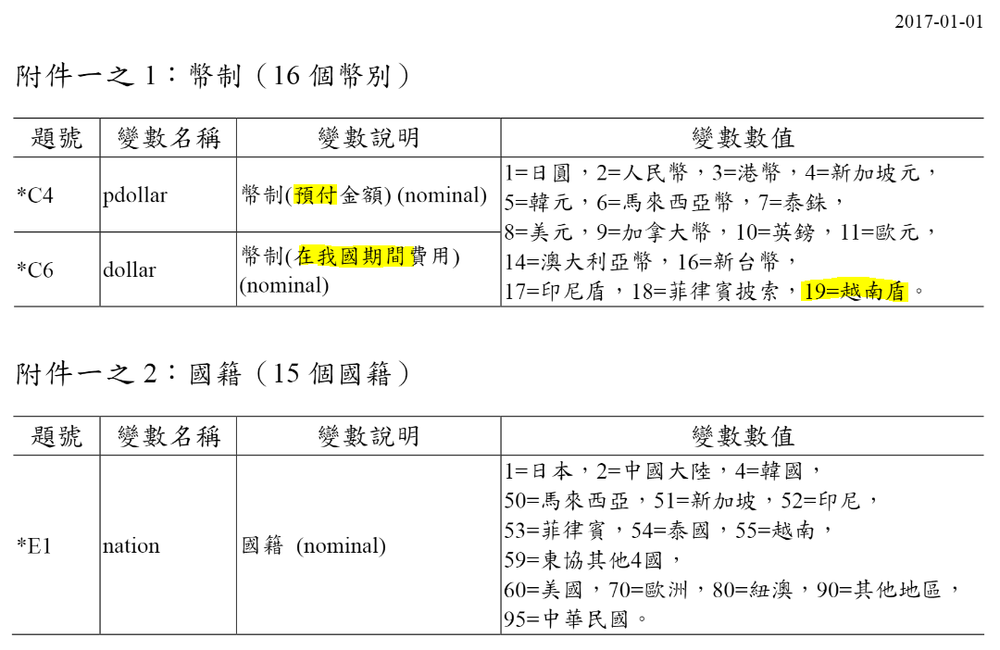
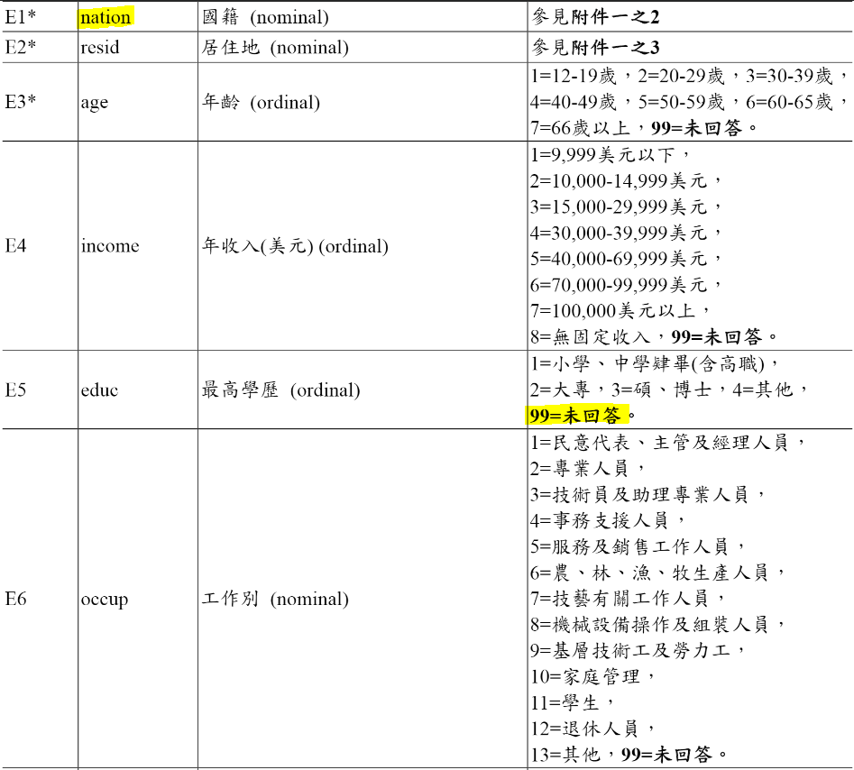

```{r Load Packages, results='hide', echo=FALSE, include=FALSE}
library(tidyverse)
options(stringsAsFactors = F)
```


```{r Read in file, results='hide'}
years <- c(103, 104, 105, 106)
original.df <- data.frame()                    
for(i in 1:4) {
  file.name <- paste0("./data/", years[i], "年來臺旅客消費及動向調查(原始資料).csv")
  df <- read.csv(file.name, fileEncoding = "BIG5")
  df <- df %>%
    filter(purp1 == 1 | purp2 == 1) %>%        # filter pupose == 觀光
    mutate(id = sprintf("%d%04d", years[i]+1911, as.numeric(rownames(.)))) %>% 
    mutate(year = years[i]+1911) %>%
    select(id, year, mon, nation, age, income, educ, occup, gender, stay, freq, purp1, type, btimes, bprice, prepay, pmoney, pdollar, airf, pit1, pit2, pit3, pit4, pit5, money, dollar, money1, p1, money2, p2, money3, p3, money4, p4, money5, p5, money6, p6, m601, m602, m603, m604, m605, m606, m607, m608, m609, m610, act01, act02, act03, act04, act05, act06, act07, act08, act09, act10, act11, act12, act13, act14, act15, act16, act17, act18, act19) %>%
    na_if(., ".") %>%                          # replace "." with NA
    mutate(pdollar = as.numeric(pdollar)) %>%
    mutate(dollar = as.numeric(dollar))
  original.df <- rbind(original.df, df)
}
```

```{r Exchange Rate}
exchange_rate <- read.csv("./data/IFS_12-24-2018 04-52-00-89_timeSeries.csv") 
exchange_rate$X...Country.Name[12] = "Taiwan"

exchange_rate <- exchange_rate %>%
  select(starts_with("X"), -X) %>%
  mutate_at(.funs = funs(.[12]/.), .vars = 2:ncol(.)) %>%                   # compute from USD to NTD
  mutate(code = c(2, 14, 9, 17, 7, 1, 5, 3, 6, 8, 4, 16, 10, 18, 11)) %>%   # 問卷編碼
  gather(.,  key = time, value = value, -X...Country.Name, -code) %>%       
  mutate(year = as.numeric(gsub("^X([0-9]+)M([0-9]+)$", "\\1", time))) %>%
  mutate(mon  = as.numeric(gsub("^X([0-9]+)M([0-9]+)$", "\\2", time)))

pdollar_rate <- select(exchange_rate, pdollar = code, year, mon, pdollarval = value)
dollar_rate  <- select(exchange_rate, dollar  = code, year, mon, dollarval  = value)
original.df <- original.df %>%
  left_join(., pdollar_rate) %>%
  left_join(., dollar_rate)

all.df <- original.df %>%     # all.df: tidyform dataframe
  mutate(pmoney = as.numeric(pmoney) * pdollarval) %>%
  mutate(money = money * dollarval) %>%
  mutate(money1 = money1 / as.numeric(p1) * dollarval) %>%
  mutate(money2 = money2 / as.numeric(p2) * dollarval) %>%
  mutate(money3 = money3 / as.numeric(p3) * dollarval) %>%
  mutate(money4 = money4 / as.numeric(p4) * dollarval) %>%
  mutate(money5 = money5 / as.numeric(p5) * dollarval) %>%
  mutate(money6 = money6 / as.numeric(p6) * dollarval) %>%
  mutate_at(.funs = funs(. * dollarval), .vars = vars(m601, m602, m603, m604, m605, m606, m607, m608, m609, m610)) %>%
  select(-pdollar, -dollar, -p1, -p2, -p3, -p4, -p5, -p6, -pdollarval, -dollarval)
```


```{r Save to Rds}
saveRDS(all.df, "alldf.rds")
all.df <- readRDS("./alldf.rds")
```


```{r data type refresh}
alldf <- readRDS("./alldf.rds")
dim(alldf)
str(alldf)

alltb <- as.tibble(alldf)

# alltb

cols = 1:length(alltb)
alltb[,cols] <-  apply(alltb[,cols], 2, function(x) as.numeric(as.character(x)))

cols = c()
alltb
# glimpse(alltb)
# NA & double
```

- 99 = 未回答

## Dep. Var
### Exchange Rate problem

```{r about dollar exchange}
(PreSum <- alltb %>% 
  group_by(pdollar) %>% 
  summarise(n=n(),mean_pmoney=log(mean(pmoney)), sd=sd(pmoney)))

PreSum %>% 
  ggplot(aes(x=pdollar, y=mean_pmoney))+
  geom_point()+
  xlab("Dollar(Category)")+ylab("Mean_Pmoney(log)")+
  ggtitle("Before Fixing XR")
```


```{r facet wrap dollar N some var.}
# nation
alltb %>% 
  filter(!is.na(pdollar)) %>% 
  group_by(pdollar) %>% 
  ggplot(aes(x=nation, y=log(pmoney), color=as.factor(gender)))+
  geom_point()+
  facet_wrap(~pdollar)+
  xlab("Nation")+ylab("Pmoney(log)")+
  ggtitle("NATION: Before Fixing XR")

# occup
alltb %>% 
  filter(!is.na(pdollar)) %>% 
  group_by(pdollar) %>% 
  ggplot(aes(x=occup, y=log(pmoney), color=as.factor(gender)))+
  geom_point()+
  facet_wrap(~pdollar)+
  xlab("Occupation")+ylab("Pmoney(log)")+
  ggtitle("Occupation: Before Fixing XR")

alltb %>% 
  filter(!is.na(pdollar)) %>% 
  filter(occup!=99) %>%
  group_by(pdollar) %>% 
  ggplot(aes(x=occup, y=log(pmoney), color=as.factor(gender)))+
  geom_point()+
  facet_wrap(~pdollar)+
  xlab("Occupation")+ylab("Pmoney(log)")+
  ggtitle("Occup filter out 99")
```



```{r TEST glimpse simple fix XR}

```

